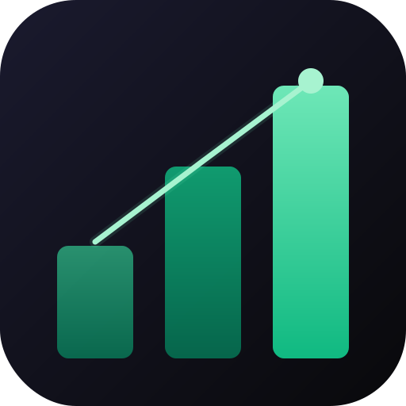

<p align="center">
  
</p>

# 💰 Wealth Manager

Personal finance tracker with multi-account support, budgets, loan tracking, and currency conversion. Built as a mobile-first web app with a companion CLI and Claude AI integration.

## ✨ Features

### 🏠 Dashboard
- Total balance across all accounts (with cross-currency conversion)
- Net balance, income, and expense summaries for any time range
- Daily balance trend chart
- Income and expense breakdowns by category (pie charts)
- Budget and loan overview widgets
- Quick-add transaction button

### 💸 Transactions
- Track income and expenses across multiple accounts
- Full-text search and filtering by date range, account, and category
- Infinite scroll with 30 transactions per page
- Attach transactions to loan payments (principal, interest, prepay fees)
- Bulk import from file

### 🎯 Budgets
- Set spending limits by category with monthly, yearly, or custom date ranges
- Scope budgets to specific accounts
- Track amount spent, percentage used, days remaining, and suggested daily spend

### 🏦 Loan Tracking
- Manage borrowed and lent loans with counterparty and status tracking
- Record payments split into principal, interest, and prepay fee components
- Link each payment component to an actual transaction
- View remaining balance and payment history per loan

### 🗂️ Accounts & Categories
- Multiple financial accounts, each with its own currency (USD or VND)
- Set a default account for quick transaction entry
- Hierarchical categories (parent → child) for income and expenses
- Custom icons per category

### 💱 Exchange Rates
- Store exchange rates between currency pairs
- Automatic conversion when calculating cross-account totals

### 🔑 API Keys
- Generate API keys for CLI and third-party access
- Keys are hashed on storage and shown once at creation

## 🛠️ Tech Stack

| Layer | Technology |
|---|---|
| Framework | Next.js 16 (App Router) |
| Language | TypeScript 5 |
| Styling | Tailwind CSS 4, shadcn/ui |
| Data fetching | TanStack Query 5, Axios |
| Forms | React Hook Form |
| Charts | Recharts |
| Database | PostgreSQL + Prisma 7 |
| Auth | JWT + bcrypt |
| PWA | next-pwa |

## 🚀 Development

```bash
pnpm install
pnpm dev
```

Open [http://localhost:3000](http://localhost:3000).

## 🐳 Deployment

```bash
docker compose -f docker-compose.prod.yml up -d
```

## ⌨️ CLI

The `wm` CLI lets you query and manage your finances from the terminal (or via Claude).

### Install

From the project root (one-time):

```bash
pnpm link --global
```

### Setup

Run the config wizard:

```bash
wm config
```

This saves your API key and base URL to `~/.wm/config.yml`. Generate an API key in the app under **Settings > API Keys**.

You can also override config with environment variables:

```bash
export WM_API_KEY=wm_...
export WM_BASE_URL=https://your-deployed-app.com
```

### Commands

```bash
wm help                                      # show all commands

# Accounts & transactions
wm accounts                                  # list accounts
wm transactions                              # recent transactions
wm transactions --from 2026-03-01 --to 2026-03-31

# Summary
wm summary                                   # this month's income / expenses
wm summary --year 2026 --month 2

# Add / delete
wm add 50000 "Food" --desc "Lunch"           # add an expense
wm add 1500000 "Salary" --date 2026-03-15    # add income with a specific date
wm delete <id>                               # delete a transaction

# Other
wm categories                                # list categories
wm budgets                                   # list budgets with progress
wm exchange-rates                            # list exchange rates
```

## 🤖 Claude Integration

With the CLI installed, use `/wm` in Claude Code to let Claude answer finance questions and manage transactions on your behalf.

An MCP server is also available for deeper integration:

```bash
pnpm mcp:standalone
```
